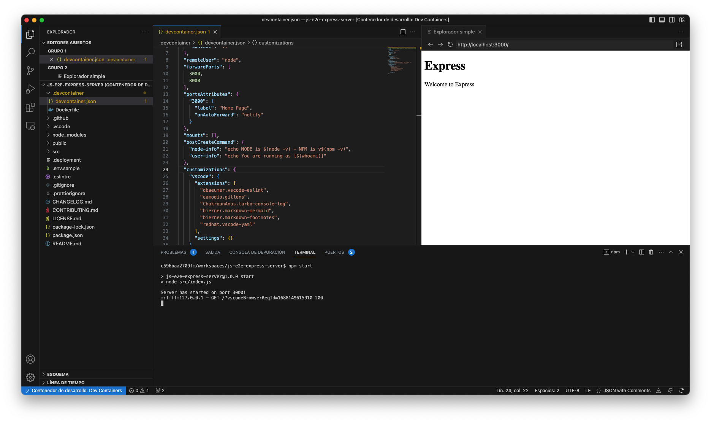

# Dev Container

The [dev container image](../.devcontainer/devcontainer.json) is set to the Azure App Service LTS. Use this  to find a different image to suit your needs. 

* [Current image](../.devcontainer/devcontainer.json)
* [List of maintained dev containers](https://github.com/devcontainers/templates/blob/main/src)
* [Create Dev Container](https://code.visualstudio.com/docs/devcontainers/create-dev-container)
* [Dev Containers - Marketplace VS](https://marketplace.visualstudio.com/items?itemName=ms-vscode-remote.remote-containers).

# Using the Dev Container

* Thanks for @dsandovale for dev container and images

